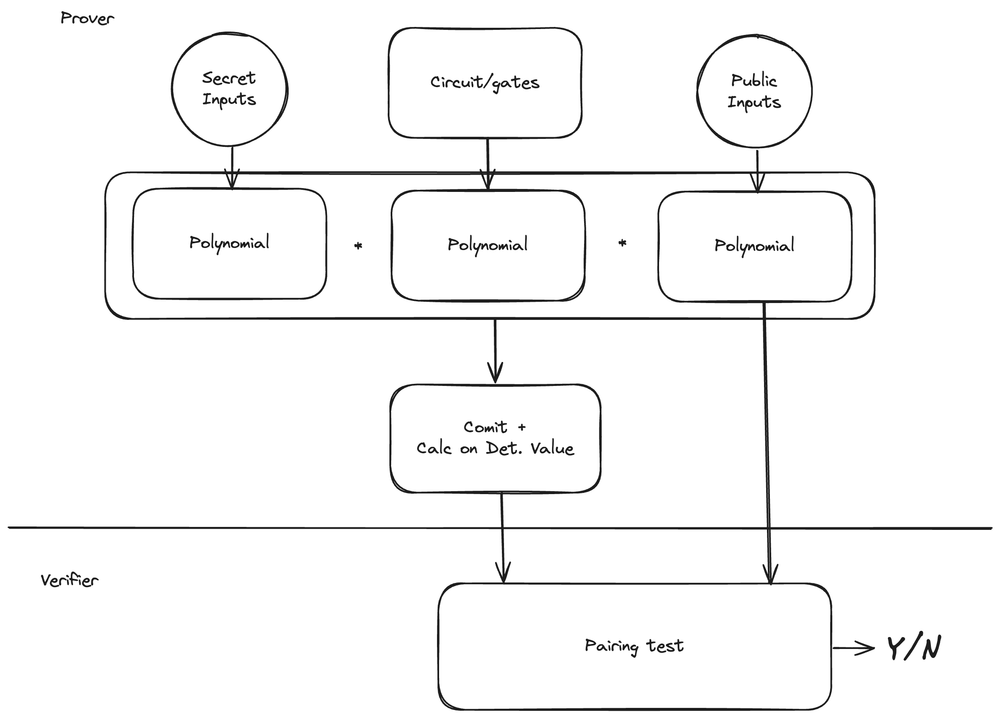
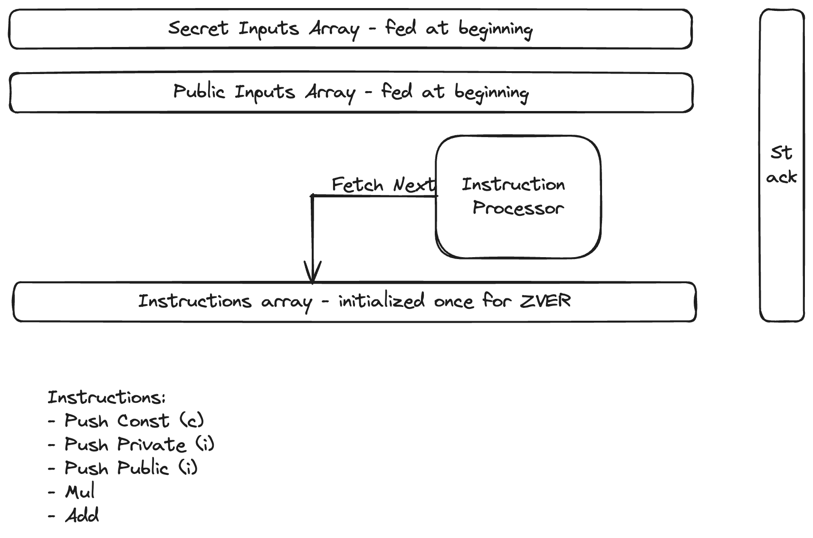

# ZVER - FHE ZK Verifier

For demo and video see [here](./docs/README.md).

## Abstract

We create and demonstrate a proving system that can run inside FHEnix, an EVM blockchain that is capable of Fully Homomorphic Encryption (FHE). As the FHE acts on the two operations, addition ("+") and multiplication ("*") allowing calculations of both operations on encrypted data, the inverse operations are quite expensive in terms of computational resources (Gas). Exponentiations is quite unreasonable and calculation of a Bilinear Pairing Function is prohibitive. To make reasonable compromise, we
arithmetize general computations into polynomial evaluation and execute them on-chain. This allows for small "proofs" to execute and
"show" the results instead of proving them by checking commitments
and calculations on a pre-calculated quasi-random point using Bilinear Pairing functions.

## Introduction

Imagine the following:
- Generate a ZK proof.
- Verify the proof. Keep the result a secret (usually the verification, especially on-chain one is public).
- Based on the result of the verification, run further calculations,
without revealing the verification result or the further calculations.

In FHE this is doable, but better written with the cost of each FHE
operation in mind.

## Anatomy of a ZK Proof

Here is a somewhat naïve anatomy of a ZK proof (one variant of it):



1. The prover is generated by converting the computing circuit of "gates" into a polynomial. In it, each gate is represented as a small polynomial, and the interconnection wiring is also a polynomial, all multiplied together. At each sampling point "x",
the resulting polynomial evaluates to the value sampled at that point. 

2. Once the prover circuit and a polynomial from it is generated,
for each evaluation, the secret inputs are also represented by a polynomial, sampling a value at each point.

3. The public inputs feed into polynomial calculations on both the
prover and verifier side.

To generate a proof, the prover commits to a "composite" polynomial and also evaluates it at a deterministically calculated
quasi-random point upon which selection the prover has no influence (Shamir-Fiat transformation).

To verify the proof, the verifier performs polynomial evaluation on
the public inputs, and succinctly verifies the calculation at the
quasi-random point against the commitment calculated by the prover.

### The dereaded Bilinear Pairing Function

All above is feasible inside FHE calculations on encrypted data, except for a very crucial part: the Pairing Function. Without going into it, just to show the amount of operations needed, let's see its pseudo-code:
```
Function MillerLoop(Q, P, r):
    Input: Q - point on the curve in G2,
           P - point on the curve in G1,
           r - order of the group (usually the curve's order or a factor thereof)
    Output: f - an element of the extension field (the pairing result before final exponentiation)

    // Initialize variables
    f = 1 (the identity element of the field)
    T = Q (temporary point on the curve)

    // Loop over the bits of r, excluding the least significant bit
    for i from m-2 down to 0 do:
        // Double the current value of f, incorporating T
        // l(A, A, C) is a tangential line touching T, evaluated at C
        f = f^2 * l(T, T, P)
        T = 2*T

        // If the i-th bit of r is 1, add Q to T and update f accordingly
        if r[i] == 1 then:
            // l(A, B, C) is a line going through A and B evaluated at C
            f = f * l(T, Q, P)
            T = T + Q

    // Return the accumulated value
    return f

```

We can see that this contains a loop ove the number of bytes, and inside each iteration, a line extrapolation containing division, an operation very expensive in FHE.

At the end, the result has to be exponentiated, which is another huge expense in FHE.

## How is ZVER made

Looking at the obstacle in calculating the Bilinear Pairing Function, we shall leave the Succinctness of ZK proofs to future improvements, and try to settle for secrecy only.

Now, we can simply play out the calculation and
verify its results.

Generally, we could enter the secret inputs into a FHEnix program and let it calculate the final conditions. If we do this, we are sacrificing 2 guarantees:
- There is no guarantee that the program will not leak the private data.
- There is no guarantee that the program will ever finish (the Halting Problem).

Instead, we will create a simple finite-state Pushdown Automoaton, in which each operation is either push, multiply or add. At the end, if the result is $0$, the verification passes:



## Demo


## Consclusion

### Is ZVER a success? 

Partially:

Successes:
- It preserves secrecy.
- It prevents leakage.
- It always halts.

Failure:
- We lost succinctness (until a better FHE friendly Bilinear Pairing Implementation).

A side conclusion of this project would at least be:

$FHE \supseteq zkSNARK \setminus S = zkNARK$

Or put in words, short of succinctness FHEnix apps can do everything a zkSNARK app can do.

### Usages of ZVER

It would be good for:
- Private funds transfer applications.
- Private voting applications.

It's not good for:
- Rollups (because of lack of succinctness).

## Future Work

The obvious work needed is to come up with a FHE friendly Bilinear Pairing Function, or a completely different method of succinct computation commitment. Possibly something that utilizes the homomorphic properties of FHA. Maybe even a primitive, that would be built inside FHA, which is beyond the scope of this project.